# Tiefenanalyse „Werkstatt-Server" — Grundlage für einen Neubau

**Ziel dieses Dokuments:** Eine vollständige, verhaltensgetreue Beschreibung dessen, was die
bestehende App (`werkstatt/garage_v2.html` + `werkstatt/server.js`) **heute tatsächlich tut** —
bis auf Feldebene — damit daraus ein Neubau mit **Docker Compose (3 Container: DB, Spring-Boot-
Backend, Next.js-Frontend)** entstehen kann, der **alle Funktionen erhält**. Ergänzt um
UML-nahe Diagramme (Use-Case, Aktivität, Zustand, Klassen, ER, Sequenz) und einen Fragen-/
Brainstorming-Katalog für Architekturentscheidungen, die der IST-Code nicht beantwortet.

Quellcode-Basis: `garage_v2.html` (5849 Zeilen, vollständig gelesen), `server.js` (273 Zeilen,
vollständig gelesen). Stand: 2026-09-25. Keine Annahmen ohne Code-Beleg — wo ich etwas nicht
im Code finden konnte, steht das explizit dabei.

---

## Inhaltsverzeichnis

1. [Domänenüberblick & Glossar](#1-domänenüberblick--glossar)
2. [Akteure & Rollen](#2-akteure--rollen)
3. [Use-Case-Diagramm & Use-Case-Beschreibungen](#3-use-case-diagramm--use-case-beschreibungen)
4. [Geschäftsprozesse (BPMN-artig)](#4-geschäftsprozesse-bpmn-artig)
5. [Aktivitätsdiagramme (Detailabläufe)](#5-aktivitätsdiagramme-detailabläufe)
6. [Zustandsdiagramm: Auftrags-Lebenszyklus](#6-zustandsdiagramm-auftrags-lebenszyklus)
7. [Datenmodell IST — wie heute tatsächlich gespeichert wird](#7-datenmodell-ist--wie-heute-tatsächlich-gespeichert-wird)
8. [Datenmodell SOLL — normalisiertes ER-Modell für den Neubau](#8-datenmodell-soll--normalisiertes-er-modell-für-den-neubau)
9. [Klassendiagramm — Domänenmodell für Spring Boot](#9-klassendiagramm--domänenmodell-für-spring-boot)
10. [Sequenzdiagramme](#10-sequenzdiagramme)
11. [Vollständiges Funktionsinventar (Seite für Seite, Feld für Feld)](#11-vollständiges-funktionsinventar-seite-für-seite-feld-für-feld)
12. [Bugs, Inkonsistenzen & technische Eigenheiten im IST-Code](#12-bugs-inkonsistenzen--technische-eigenheiten-im-ist-code)
13. [Zielarchitektur: Docker Compose mit 3 Containern](#13-zielarchitektur-docker-compose-mit-3-containern)
14. [REST-API-Entwurf](#14-rest-api-entwurf)
15. [Offene Entscheidungen & Brainstorming](#15-offene-entscheidungen--brainstorming)
16. [Nicht-funktionale Anforderungen](#16-nicht-funktionale-anforderungen)

---

## 1. Domänenüberblick & Glossar

Die App ist ein **Dispositions- und Planungswerkzeug** für eine Autowerkstatt (Krügel
Fahrzeugtechnik). Sie ersetzt **nicht** die offizielle Fakturierung/Buchhaltung (die läuft
weiter im separaten "SwissGarage"/C16-Programm) — sie ist die Schicht dazwischen: Termine
disponieren, Lifts belegen, Mechaniker zuteilen, Ersatzwagen verwalten, interne Kommunikation
(Pinnwand/To-dos), Mitarbeiterkalender.

| Begriff (im Code) | Bedeutung |
|---|---|
| **Auftrag** | Zentrale Entität: ein Kundentermin mit Fahrzeug, Datum/Zeit, Mechaniker, Lift, auszuführenden Arbeiten und Status. Entspricht sowohl "Termin" als auch "Werkstattauftrag" — es gibt im Code keine Trennung zwischen beidem. |
| **Auftragsnummer (`aufnr`)** | Freitext-Nummer, die **manuell** aus dem externen Werkstattprogramm (SwissGarage/C16) übertragen wird. Kein Fremdschlüssel, keine Validierung, kein Zwangsformat. |
| **Lift** | Eine von 3 fest codierten Hebebühnen ("Lift 1/2/3"). Kein Stammdatenobjekt, nur ein String `'1'|'2'|'3'` am Auftrag. |
| **Wartekunde** | Boolean-Flag am Auftrag: Kunde wartet vor Ort, bis das Fahrzeug fertig ist (unabhängig vom Status). |
| **Ersatzwagen (EW)** | Poolfahrzeug, das Kunden während der Reparatur leihweise erhalten. |
| **Ersatzwagen-Belegung** | Ein Buchungszeitraum eines Ersatzwagens (von–bis Datum, Kunde/Auftrag). Läuft **parallel und unsynchronisiert** zum einfachen `belegt`-Flag am Ersatzwagen selbst (siehe [Abschnitt 12](#12-bugs-inkonsistenzen--technische-eigenheiten-im-ist-code)). |
| **Pinnwand / Notiz** | Interne Kanban-artige Nachricht, einem Mitarbeiter zugewiesen ("Post-it"), optional mit Auftragsbezug, kann Unteraufgaben haben und wird archiviert statt gelöscht. |
| **To-do** | Eigenständige Aufgabenliste, kann aber auch automatisch aus einer Pinnwand-Notiz oder aus einem Auftrag heraus erzeugt werden (`notizId`/`auftragNr` als lose Referenz). |
| **Einkaufsliste** | Kein eigenes Modul — ein To-do mit Flag `einkauf: true`. |
| **Mitarbeiter-Event** | Abwesenheits-/Ereigniseintrag im Mitarbeiterkalender: Ferien, Krank, Fremdarbeit (extern), Kurs, Geburtstag. |
| **SwissGarage-Import** | Einmaliger/wiederholbarer Excel-Import (Adrliste.xlsx, Fahrzeug.xlsx) aus dem externen ERP, dient nur als **Nachschlage-Cache** für die Kundensuche in Schritt 1 des Termin-Wizards — keine Rückschreibung. |
| **Kapazitätsübersicht** | 2-Wochen-Zeitraster (07:00–17:30, 30-Min-Slots) aller Aufträge, dient als visuelle Planungshilfe beim Anlegen eines neuen Termins. Ist **keine echte Kapazitätsprüfung** (keine Slot-Limits, keine Überbuchungs-Warnung). |
| **Feiertag** | Zur Laufzeit berechnet (Gauss'sche Osterformel) für Kanton Zürich, nicht in der DB gespeichert. |

---

## 2. Akteure & Rollen

Der IST-Code kennt **keine Benutzerkonten, kein Login, keine Rollen im technischen Sinn**
(kein `passwort`/`login`/`auth` im gesamten Code). "Mitarbeiter" ist eine reine Stammdaten-Entität
(Namensliste für Dropdowns/Zuweisungen), keine Identität, mit der man sich anmeldet.

Für die Use-Case-Analyse leite ich die **fachlichen** Akteure aus den UI-Rollenfeldern und dem
Kontext ab (`rolle`: Mechaniker / Büro / Praktikum / Lernender, plus implizit Geschäftsführer aus
den Testdaten):

| Akteur | Beschreibung | Im IST-Code technisch unterscheidbar? |
|---|---|---|
| **Empfang/Disposition** | Nimmt Kundenanrufe/-besuche entgegen, legt Termine an, verwaltet Ersatzwagen | Nein — jeder mit Zugriff auf die URL kann alles |
| **Mechaniker** | Sieht seine Aufträge, ändert Status, schreibt Notizen/To-dos | Nein |
| **Werkstattleitung/Geschäftsführung** | Verwaltet Mitarbeiterstammdaten, sieht Statistiken (Ferien etc.) | Nein — `permTermine/permTodos/permPinnwand`-Flags steuern nur, **wo eine Person in Dropdowns erscheint**, nicht wer etwas darf |
| **Externes System "SwissGarage/C16"** | Quelle der Kundenstammdaten (Excel-Export), Ziel der manuellen Auftragsnummer-Rückmeldung | Kein technischer Akteur, rein manueller Medienbruch |

**Wichtig für den Neubau:** Es gibt aktuell **keinerlei Autorisierung**. Jede Aktion, die im
Use-Case-Kapitel einem Akteur zugeordnet wird, ist im IST-Zustand von jedem im Netzwerk
ausführbar. Ob der Neubau echte Benutzerkonten/Rollen bekommt, ist eine offene Entscheidung
(siehe [Abschnitt 15](#15-offene-entscheidungen--brainstorming)).

---

## 3. Use-Case-Diagramm & Use-Case-Beschreibungen

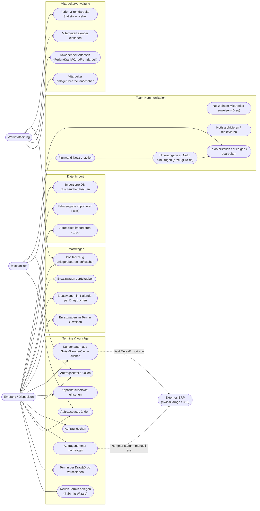

### Use-Case-Beschreibungen (Auszug der wichtigsten, mit Vor-/Nachbedingung und Ablauf)

#### UC1 — Neuen Termin anlegen
- **Akteur:** Empfang/Disposition
- **Vorbedingung:** Keine (Wizard ist immer erreichbar)
- **Hauptablauf:**
  1. Schritt 1: Kunde entweder über SwissGarage-Cache-Suche (Name/Kennzeichen, min. 2 Zeichen) finden und Felder automatisch befüllen lassen, oder manuell Vor-/Nachname + Fahrzeugdaten eingeben.
  2. Schritt 2: Datum/Uhrzeit, optionale Flags ("kommt früher", "fertig bis", "Wartekunde"), Mechaniker + Lift wählen, Arbeiten ankreuzen (Radwechsel, MFK, Service-Checkliste mit 8 Positionen, Material bestellen), Freitext "Arbeiten" + "Notizen", optional Ersatzwagen mit Abhol-/Rückgabezeit. Rechts daneben live die 2-Wochen-Kapazitätsübersicht.
  3. Schritt 3: Auftrag ist zu diesem Zeitpunkt **bereits gespeichert** (`buildAuftrag()` + Push in `S.auftraege` + Socket-Save passiert beim Wechsel zu Schritt 3, nicht erst am Ende!). Nutzer trägt die im externen ERP vergebene Auftragsnummer nach.
  4. Schritt 4: Zusammenfassung, Druckvorschau, Button "Auftragszettel drucken" (`window.print()`).
- **Alternativablauf:** Kein Kundenname eingegeben → Toast "Bitte Kundennamen eingeben", Wizard bleibt auf Schritt 1. Kein Datum → analoge Fehlermeldung.
- **Nachbedingung:** Neuer Datensatz in `auftraege`, bei Ersatzwagenwahl `ew.belegt=true` gesetzt (siehe Bug in Abschnitt 12).
- **Besonderheit:** Der Auftrag existiert (Status `Eingang`) unabhängig davon, ob der Nutzer den Wizard bis Schritt 4 durchläuft oder vorher den Browser schliesst — es gibt keinen expliziten "Abbrechen"-Button im Wizard.

#### UC2 — Termin per Drag&Drop verschieben
- **Akteur:** Empfang/Disposition
- **Kontext:** Möglich an **vier** unabhängigen Stellen mit **vier unterschiedlichen
  Implementierungen** (kein gemeinsamer Code!):
  1. Dashboard-Wochenraster (`dbWocheDragStart`/`dropZone` in `renderDashboard`) → ändert nur `datum`.
  2. Dashboard-Lift-Spalten (`renderLifts`) → ändert `lift` + `reihenfolge` (manuelle Sortierung innerhalb der Spalte).
  3. Termine-Tagesansicht, 3 Lift-Spalten (`tcDragStart`/`renderTermine`) → ändert `lift` + `reihenfolge`.
  4. Termine-Wochenansicht, 9-Tage-Raster (`tDragStart`/`renderTermine`) → ändert nur `datum`.
  - Zusätzlich existiert eine **fünfte, scheinbar tote** Implementierung `initDragDrop()` mit
    Klassen `.woche-karte`/`.woche-dropzone`, die im aktuell gerenderten HTML nirgends erzeugt
    wird (siehe Abschnitt 12) und **Uhrzeit-Interpolation** zwischen Nachbarkarten beherrscht —
    ein Feature, das in den aktiven Implementierungen fehlt.
  - Touch-Geräte (Tablets am Empfang) werden über einen manuellen `touchstart/move/end`→
    `DragEvent`-Polyfill am Dateiende unterstützt.
- **Nachbedingung:** `socketSpeichern('auftraege', a)` → Server-Persistenz + Broadcast an alle Clients.

#### UC3 — Auftragsstatus ändern
- **Akteur:** Empfang, Mechaniker
- **Wege:** (a) Dropdown im Bearbeiten-Modal ("Ansichtsmodus" → Status-Pille mit Dropdown,
  `evSetStatus`), (b) Select-Feld im Vollbearbeitungsmodus (`saveEditTermin`), (c) *nicht*
  direkt in der Tabellenansicht "Aufträge" (dort nur über Klick → Modal).
- **Werte:** `Eingang` (Default bei Neuanlage) → `In Arbeit` → `Wartet` (Beschriftung im
  Edit-Select: "Wartet auf Teile") → `Fertig`. `Wartekunde` ist technisch auch ein Statuswert
  im Status-Dropdown des Ansichtsmodus, obwohl es inhaltlich ein orthogonales Flag ist (siehe
  Abschnitt 12).

#### UC9 — Ersatzwagen im Termin zuweisen
- **Akteur:** Empfang
- **Ablauf:** Im Wizard-Schritt 2 oder im Auftrags-Bearbeitungsmodus ein Poolfahrzeug aus
  Dropdown wählen → Abhol-/Rückgabe-Datum+Zeit setzen (vorbefüllt mit Termin-Datum) →
  Verfügbarkeitstabelle (±2 Tage, alle Poolfahrzeuge) zeigt "Belegt"/"Termin"/frei (grüner
  Punkt) an, berechnet **ausschliesslich aus dem `belegt`-Flag**, nicht aus den echten
  Buchungszeiträumen.
- **Nachbedingung:** `ew.belegt=true`, `ew.belegtVon=<auftragId>` am gewählten Ersatzwagen.
  **Keine** Zeile in `ersatzwagen_belegungen` wird dabei erzeugt.

#### UC10 — Ersatzwagen im Kalender per Drag buchen
- **Akteur:** Empfang
- **Ablauf:** Auf der Ersatzwagen-Seite im 9-Tage-Belegungskalender mit gedrückter Maustaste
  über freie Zellen einer Fahrzeugzeile ziehen (`maKalDrag`-artiges Pattern, hier `ewDrag`) →
  Panel "Ersatzwagen zuweisen" öffnet sich mit vorbefülltem Zeitraum → Freitext-Kundenname
  eingeben → Speichern.
- **Nachbedingung:** Neue Zeile in `ersatzwagen_belegungen` (`wagenId`, `kunde` als Freitext —
  **kein Bezug zu einem Auftrag oder Kundendatensatz**, ausser der Nutzer trägt zufällig die
  Auftragsnummer im Freitextfeld ein). **Kein** `ew.belegt`-Flag wird gesetzt.

#### UC13/UC16 — Pinnwand-Notiz + Unteraufgabe
- **Akteur:** Mechaniker/Empfang
- Eine Notiz wird einer Spalte zugeordnet (Mitarbeiter oder "Neu"), kann per Drag zwischen
  Spalten verschoben werden, hat ein Detail-Modal mit: Bearbeiten (Inline-Text-Edit),
  Auftragsverknüpfung (Dropdown über alle Aufträge), Mehrfachzuweisung an mehrere Mitarbeiter
  (Klick-Toggle-Chips), Freitext "Infos", und eine Liste von "Aufgaben". Jede neu erfasste
  Aufgabe legt **gleichzeitig** einen Eintrag in `n.aufgaben[]` (nur `{text, done}`, wird nach
  Erstellung nie wieder aktualisiert) **und** einen vollständigen `todos`-Datensatz an
  (`notizId` verweist zurück). Abhaken einer Aufgabe im Notiz-Modal hakt **nur** den
  verknüpften Todo ab, nicht das `n.aufgaben[i].done`-Feld.
- Archivieren markiert `archiviert=true` **und** setzt alle verknüpften offenen To-dos auf
  erledigt (`pwArchivierenMitTodos`). Reaktivieren macht das nicht vollständig symmetrisch
  rückgängig (siehe Abschnitt 12).

#### UC19/UC21 — Abwesenheit erfassen / Statistik einsehen
- **Akteur:** Leitung
- Erfassung per Modal (Person, Kategorie, Titel, Von/Bis) **oder** per Drag-Auswahl direkt im
  Monatskalender (`maKalDragStart`/`maKalDragEnter`, analog zum EW-Kalender).
- Statistik-Tab zeigt Kennzahlen (Ferientage Total, Extern-Einsätze, Anzahl externer Partner)
  sowie pro Mitarbeiter: Anspruch, Bezogen, Saldo (Fortschrittsbalken), Extern-Tage nach Firma.
- **Kritischer Fund:** Diese Auswertung liefert im Betrieb **immer 0**, siehe Bug #1 in
  Abschnitt 12 — Kategorie-Schlüssel-Mismatch zwischen gespeicherten Events (`"Ferien"`) und
  Zählfunktion (`'ferien'`).

*(Die übrigen ~15 Use-Cases sind im [Funktionsinventar](#11-vollständiges-funktionsinventar-seite-für-seite-feld-für-feld) auf Feldebene beschrieben; ich habe hier nur die verhaltensmässig interessantesten ausführlich dargestellt, um Redundanz zu vermeiden.)*

---

## 4. Geschäftsprozesse (BPMN-artig)

Mermaid kennt keine native BPMN-Notation; die folgenden Flowcharts bilden Pools/Swimlanes über
`subgraph` nach — funktional äquivalent zu einem einfachen BPMN-Kollaborationsdiagramm.

### 4.1 End-to-End-Prozess: Kunde bringt Fahrzeug zur Reparatur

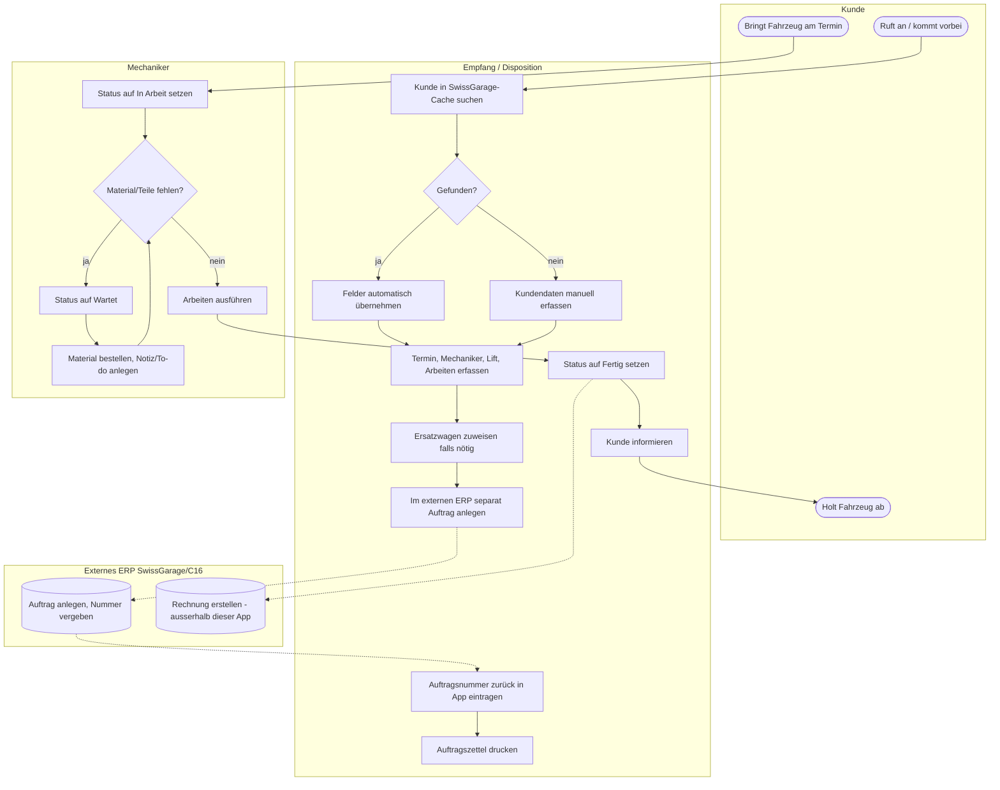

**Wichtige Beobachtung:** Der Schritt "E7 → X1 → E8" ist ein **manueller Medienbruch** — die
App hat keinerlei technische Verbindung zum ERP. Im Neubau ist dies die offensichtlichste
Stelle für eine echte Integration (API/Datei-Schnittstelle), sofern das ERP das zulässt
(aktuell unbekannt — reines Windows-Altsystem, siehe `CLAUDE_CONTEXT.md`).

### 4.2 Prozess: Ersatzwagen-Verwaltung (zeigt die Doppelspurigkeit)

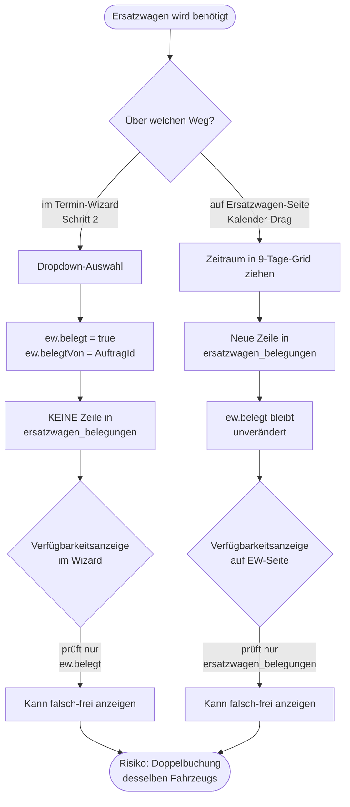

### 4.3 Prozess: Notiz → Aufgabe → To-do (Pinnwand-Workflow)

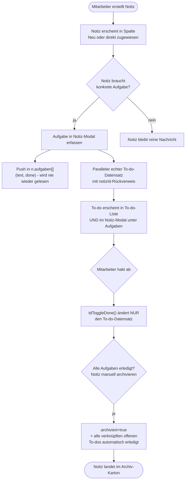

### 4.4 Prozess: SwissGarage-Datenimport

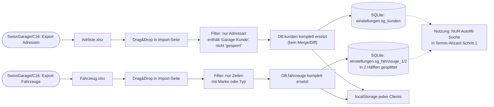

---

## 5. Aktivitätsdiagramme (Detailabläufe)

### 5.1 Aktivität: `buildAuftrag()` — was beim Speichern eines Termins tatsächlich passiert

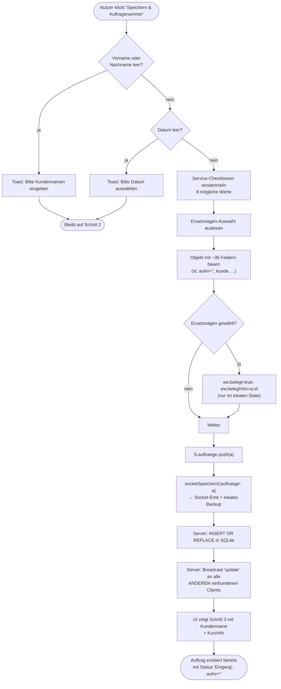

**Bemerkenswert:** Der Auftrag ist ab diesem Zeitpunkt vollwertig in der Datenbank — auch wenn
der Nutzer danach den Browser schliesst, ohne Schritt 3/4 abzuschliessen. Es gibt keinen
"Entwurf"-Zustand.

### 5.2 Aktivität: Drag&Drop eines Auftrags in der Lift-Spalte (Tagesansicht)

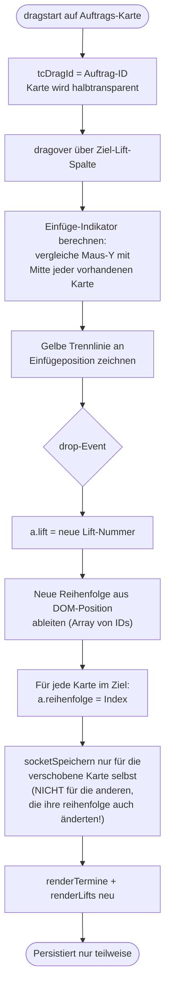

**Kritischer Fund:** In `dropZone.addEventListener('drop', ...)` (Termine-Tagesansicht) wird
nach dem Neuberechnen von `reihenfolge` für **alle** betroffenen Karten nur
`socketSpeichern('auftraege', dragAtc)` für die **gezogene** Karte aufgerufen — die
`reihenfolge`-Änderungen der anderen, nur lokal verschobenen Karten werden **nicht persistiert**
und gehen bei einem Reload/durch einen anderen Client wieder verloren (sie bleiben nur
lokal-optisch bis zum nächsten `renderAll()`). Gleiches Muster in `renderLifts()`'s Drop-Handler
(dort exakt identischer Code). In `renderDashboard()`'s Wochenraster-Drop dagegen wird nur
`datum` geändert, keine Reihenfolge betroffen — dort besteht das Problem nicht.

### 5.3 Aktivität: SwissGarage-Kundensuche im Wizard (zweistufig: Kunde → Fahrzeug)

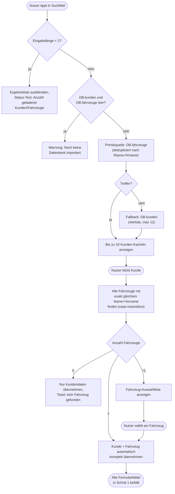

**Detail:** Das MFK-Datum aus der importierten Excel-Datei ist eine **Excel-Seriennummer**
(Tage seit 1899-12-30) und wird mit `new Date(Math.round((Number(f.mfk) - 25569) * 86400 * 1000))`
in ein Datum umgerechnet — funktioniert nur, wenn die Zelle in SwissGarage tatsächlich als
Datum/Zahl exportiert wird, nicht als Text.

### 5.4 Aktivität: Ersatzwagen-Belegung per Drag im 9-Tage-Kalender

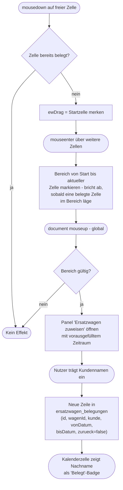

---

## 6. Zustandsdiagramm: Auftrags-Lebenszyklus

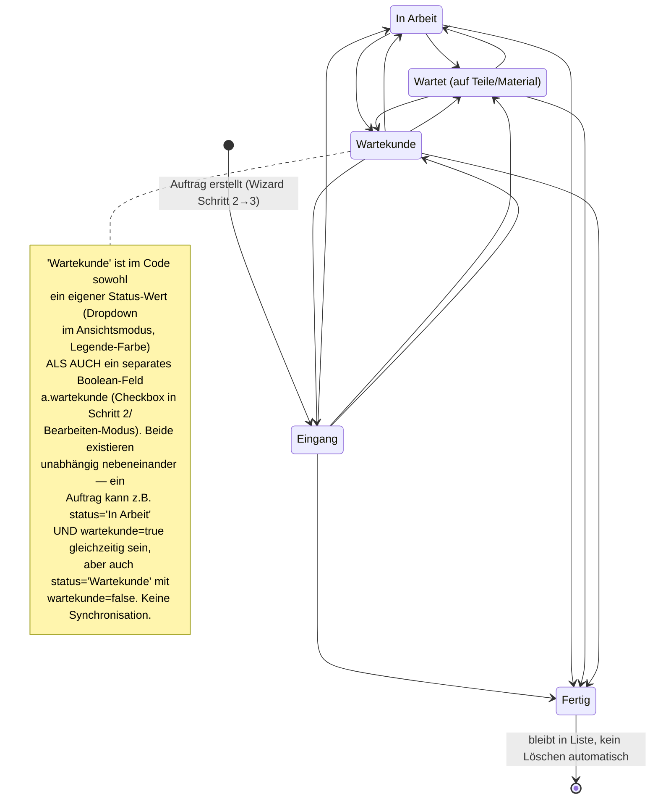

**Übergänge sind im IST-Code uneingeschränkt** — jeder Status kann direkt in jeden anderen
wechseln, es gibt keine Validierung einer sinnvollen Reihenfolge (z. B. kann `Fertig` direkt zu
`Eingang` zurückgesetzt werden). Löschen ist von jedem Status aus jederzeit möglich
(`deleteA()`), unabhängig vom Status.

---

## 7. Datenmodell IST — wie heute tatsächlich gespeichert wird

Zur Erinnerung, bevor das Zielmodell entworfen wird: **Es gibt kein relationales Schema.**
SQLite dient nur als persistenter Key-Value-Store für JSON-Blobs:

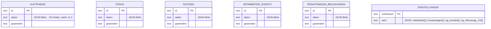

Es gibt **keine Fremdschlüssel** in der Datenbank selbst — jede Referenz (`auftragNr`, `notizId`,
`ew_id`, `kunde` als Freitext-Name) ist eine lose String-/ID-Verknüpfung, die die Anwendung zur
Laufzeit per `Array.find()` aus dem kompletten, im Speicher gehaltenen Datenbestand auflöst.
**Es gibt keine echten Kunden- oder Fahrzeug-Stammdaten** — jeder Auftrag trägt Kunden- und
Fahrzeugdaten als flache, bei Erstellung kopierte Felder (`kunde`, `tel`, `mobil`, `fahrzeug`,
`kz`, `jg`, `km`, `farbe`). Ändert sich z. B. die Telefonnummer eines Kunden, wird das nirgends
rückwirkend für alte Aufträge aktualisiert; eine Kundenhistorie ("alle Aufträge von Hans
Müller") lässt sich nur über Namens-String-Vergleich rekonstruieren (so, wie es
`renderRecentKunden()` tut — die letzten 6 Aufträge, nicht gruppiert nach Kunde).

---

## 8. Datenmodell SOLL — normalisiertes ER-Modell für den Neubau

Vorschlag für ein relationales Schema (PostgreSQL), das **alle heute vorhandenen Informationen**
verlustfrei abbildet, aber echte Stammdaten (Kunde, Fahrzeug) einführt. Begründung zur DB-Wahl
in [Abschnitt 13.2](#132-datenbankwahl-postgresql-vs-mongodb).

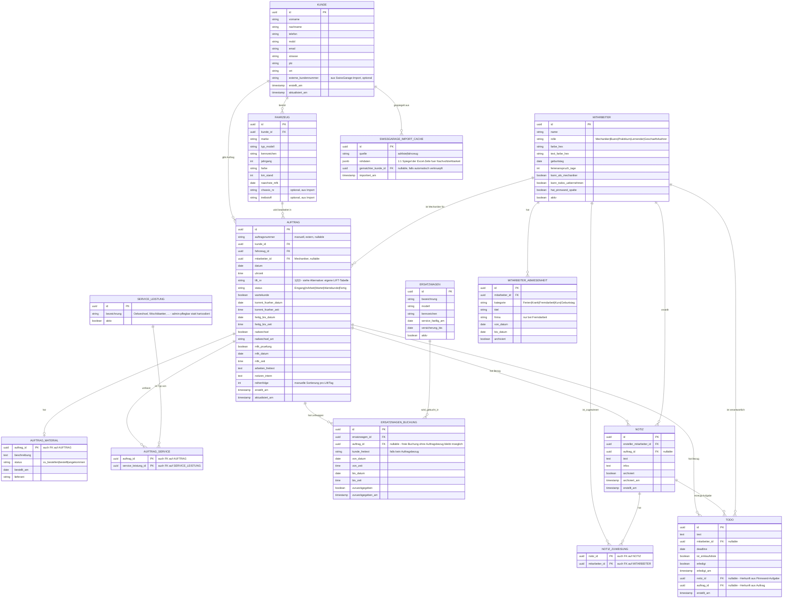

### 8.1 Mapping-Tabelle: IST-Feld → SOLL-Tabelle.Spalte

| IST (JSON-Feld in `auftraege.daten`) | SOLL |
|---|---|
| `kunde`, `vname`, `nname`, `tel`, `mobil`, `adresse` | Aufgelöst in `KUNDE` (referenziert über `auftrag.kunde_id`) |
| `fahrzeug`, `kz`, `jg`, `km`, `farbe`, `mfk` | Aufgelöst in `FAHRZEUG` (referenziert über `auftrag.fahrzeug_id`) |
| `mech` (Freitext-Name!) | `auftrag.mitarbeiter_id` (FK statt Namens-String) |
| `lift` | `auftrag.lift_nr` (bleibt String/Enum — echte `LIFT`-Tabelle nur falls Anzahl variabel werden soll, siehe Abschnitt 15) |
| `service` (String-Array aus 8 fixen Werten) | `AUFTRAG_SERVICE` M:N zu `SERVICE_LEISTUNG` |
| `material`, `mat_status`, `lieferant`, `bestellt_datum` | `AUFTRAG_MATERIAL` (1:1, nullable) |
| `ersatzwagen` (Anzeige-String), `ew_id`, `ew_abh_*`, `ew_rueck_*` | `ERSATZWAGEN_BUCHUNG` (vereinigt mit der bisher komplett separaten `ersatzwagen_belegungen`-Tabelle — behebt Bug #2) |
| `radwechsel`, `rad_art` | `auftrag.radwechsel`, `auftrag.radwechsel_art` |
| `mfk_check`, `mfk_datum`, `mfk_zeit` | `auftrag.mfk_pruefung`, `auftrag.mfk_datum/zeit` |

### 8.2 Wichtigste konzeptionelle Änderung ggü. IST

Die Einführung von `KUNDE` und `FAHRZEUG` als echte Entitäten ist die **grösste inhaltliche
Verbesserung** gegenüber dem reinen Feld-für-Feld-Port. Der IST-Zustand hat **keine**
Kundenhistorie, keine "alle Fahrzeuge eines Kunden"-Abfrage über Aufträge hinweg, keine
Möglichkeit, Stammdaten einmalig zu korrigieren. Ob das gewünscht ist oder ob der Neubau
bewusst bei der heutigen "alles Freitext am Auftrag"-Philosophie bleiben soll, ist eine
Entscheidung für den Kollegen (siehe Abschnitt 15) — technisch spricht in einem relationalen
System klar für echte Stammdaten.

---

## 9. Klassendiagramm — Domänenmodell für Spring Boot

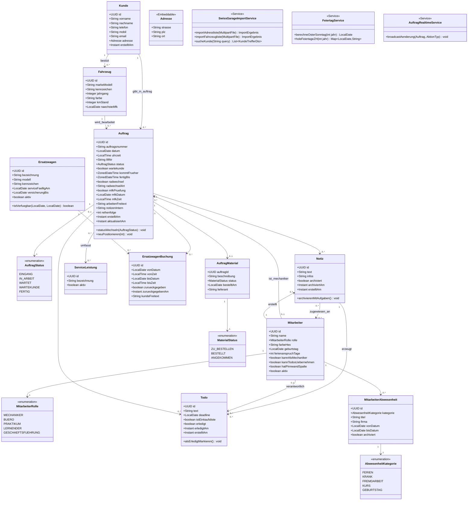

**Anmerkung zur Modellierung:** `Auftrag.statusWechseln()` und
`Ersatzwagen.istVerfuegbar()` sind hier als Methoden am Aggregat vorgeschlagen, um genau die
Business-Regeln zu kapseln, die im IST-Code **fehlen** (siehe Bug #2 und #5 in Abschnitt 12) —
z. B. sollte `istVerfuegbar()` künftig die einzige Quelle der Wahrheit für "ist dieses
Poolfahrzeug in diesem Zeitraum frei" sein, egal ob die Buchung aus dem Wizard oder dem
EW-Kalender kommt.

---

## 10. Sequenzdiagramme

### 10.1 IST: Realtime-Sync zwischen mehreren offenen Browserfenstern (Socket.IO)

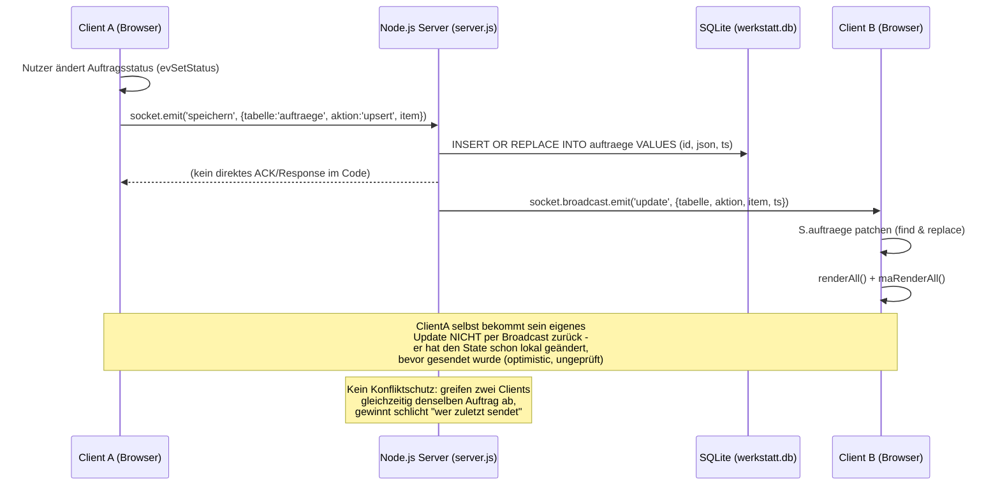

### 10.2 Vorschlag SOLL: Realtime-Sync im Neubau (Spring + Next.js)

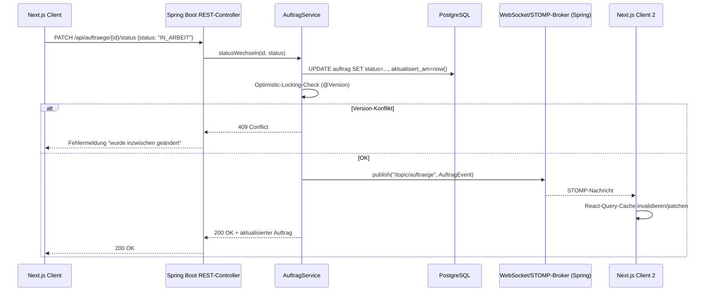

**Warum die Änderung:** Der IST-Zustand hat **kein** Konfliktmanagement (Last-Write-Wins über
volle Objekt-Überschreibung). Ein `@Version`-Feld (JPA Optimistic Locking) plus ein expliziter
Broadcast-Kanal ist die naheliegende Verbesserung, sofern Mehrbenutzerbetrieb (mehrere Tablets
am Empfang gleichzeitig) weiterhin ein Kernanforderung bleibt — wovon laut IST-Code
(Socket.IO überhaupt vorhanden) auszugehen ist.

### 10.3 IST: SwissGarage-Import (Client-seitig, kein Server-Parsing)

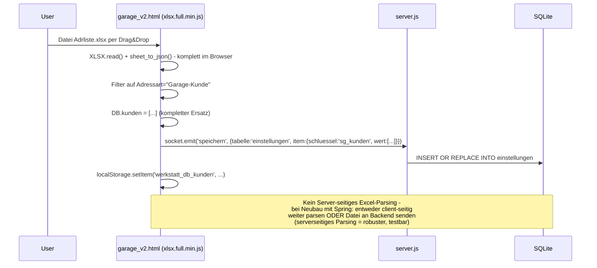

---

## 11. Vollständiges Funktionsinventar (Seite für Seite, Feld für Feld)

*(Kompakt gehalten wo bereits durch Diagramme/Use-Cases abgedeckt; Fokus hier auf exakten
Feldlisten, Defaultwerten und Detailverhalten, das oben noch nicht erwähnt wurde.)*

### 11.1 Navigation & Layout
- Hauptmenü (`<nav>`): Dashboard, ➕ Neuer Termin, Termine, Aufträge, To-dos, 📌 Pinnwand,
  👤 Mitarbeiter — **plus** ein Dropdown "⚙ Einstellungen" mit SwissGarage-Import, Mitarbeiter
  (Duplikat des Hauptmenü-Eintrags), Ersatzwagen. Identisches Dropdown-Menü existiert **ein
  zweites Mal** unten in der Dashboard-Navigationsleiste (`db-einstellungen-menu`) — zwei
  parallele Menü-Implementierungen mit dupliziertem HTML/JS (`toggleHdrEinstellungen` vs.
  `dbToggleEinstellungen`, exakt gleiche Handler-Logik).
- Auf dem Dashboard wird der `<header>` komplett ausgeblendet (`headerEl.style.display='none'`)
  — Navigation läuft dort ausschliesslich über die untere Buttonleiste. Auf allen anderen
  Seiten erscheint zusätzlich unten rechts ein schwebender "🏠 Dashboard"-Button.
- Datum/Uhrzeit-Badge oben rechts (`#datel`) zeigt das heutige Datum lokalisiert
  (`toLocaleDateString('de-CH', {weekday:'long',...})`), wird **einmalig** in `init()` gesetzt,
  **nicht** live aktualisiert (kein `setInterval`) — nach Mitternacht bleibt das alte Datum
  stehen, bis die Seite neu geladen wird.
- Server-Status-Badge (`#server-badge`) — klickbar, löst `manuellSpeichern()` aus (Bulk-Save
  aller Listen). Zustände: "Verbinde…", "NAS verbunden · HH:MM", "Offline · lokal HH:MM", "Kein
  NAS · kein lokaler Speicher", "Sync HH:MM" (bei jedem eingehenden Update), "Gespeichert HH:MM".

### 11.2 Vollständige Feldliste eines `auftrag`-Objekts (aus `buildAuftrag()` + `saveEditTermin()`)

```
id, aufnr, kunde, vname, nname, tel, mobil, adresse,
fahrzeug, kz, jg, km, farbe, mfk,
datum, uhrzeit, mech, lift,
frueher, frueher_datum, frueher_zeit,
fertig, fertig_datum, fertig_zeit,
wartekunde,
radwechsel, rad_art,
mfk_check, mfk_datum, mfk_zeit,
service_check, service[],
material_check, material, mat_status, lieferant, bestellt_datum,
arbeiten, notizen,
ersatzwagen, ew_id, ew_abh_datum, ew_abh_zeit, ew_rueck_datum, ew_rueck_zeit,
status, reihenfolge, erstellt
```
Zusätzlich in Bearbeiten-Ansicht editierbar, in `buildAuftrag()` (Neuanlage) aber **nicht**
vorhanden: nichts — die Felder sind deckungsgleich. Im Server-Seed (`seedTestdaten`) tauchen
zusätzlich `frueher_datum`/`frueher_zeit` ohne `frueher:true`-Konsistenzprüfung auf.

### 11.3 Dashboard
- **Wochenraster (oben, 28 % Höhe):** 9 Spalten (aktuelle Woche Mo–So + nächste Woche Mo–Di),
  navigierbar (‹ Heute ›), zeigt pro Tag Abwesenheits-Chips + Auftragskärtchen
  (`kunde.split(' ').pop()` = **nur Nachname**, sofern durch Leerzeichen trennbar — bei
  einteiligen Namen zeigt es den ganzen String), drag-fähig (ändert nur `datum`).
- **Mitte links (Tagesansicht, 3 Lift-Spalten):** identisch zu `renderLifts()`, zeigt nur
  **heutige** Aufträge, mit Statuslabel-Badge pro Karte, allen Arbeiten zusammengefasst.
- **Mitte-Mitte (Pinnwand-Mini):** 6 Spalten dynamisch aus `S.mitarbeiter` (gefiltert auf
  `permPinnwand!==false`) + fest "Neu" als erste Spalte — abweichend von der Haupt-Pinnwand-
  Seite, die auf 5 hartcodierte Namen fixiert ist (siehe Bug #3).
- **Rechts (To-dos):** erste 12 offenen To-dos nach Deadline sortiert, überfällige mit
  rotem ⚠-Icon, Badge oben zeigt Anzahl überfälliger.
- **Untere Navigationsleiste:** 6 Buttons + Einstellungen-Dropdown, wie Hauptmenü gespiegelt.

### 11.4 Termine-Seite
- Umschalter Tagesansicht/Wochenansicht.
- **Tagesansicht:** 3 Lift-Spalten (analog Dashboard, aber **für das gewählte** Datum, nicht
  zwingend heute), plus eine Sektion "Kein Lift zugewiesen" für Aufträge ohne `lift`-Wert oder
  mit ungültigem Wert (nicht `'1'|'2'|'3'`). Volltextsuche über Kunde/Fahrzeug/Kennzeichen
  filtert **vor** der Lift-Aufteilung.
- **Wochenansicht:** 9-Tage-Raster ohne Lift-Trennung, Karten gleicher Uhrzeit werden
  nebeneinander statt untereinander dargestellt (`groups`-Logik in `renderTermine()`).
- Legende: 5 Statusfarben (inkl. Wartekunde als eigene Farbe, obwohl technisch ein Flag).

### 11.5 Aufträge-Seite
- Reine Tabelle, Sortierung fix nach `erstellt` absteigend (neueste zuerst) — **nicht** nach
  Datum/Uhrzeit des Termins.
- Suche über `kunde`, `fahrzeug`, `aufnr` (case-insensitive, `includes()`).
- Statusfilter-Dropdown: exakt die 5 Statuswerte, `Wartet` hier **ohne** den Zusatz "auf
  Teile"/"auf Material" (uneinheitlich zur Edit-Maske und zum Server-Seed, siehe Bug #4).
- Klick auf Zeile → `showAuftrag()` → `editTermin()` (identisch zum Modal aus den anderen
  Ansichten). Lösch-Button pro Zeile mit `event.stopPropagation()`.

### 11.6 To-dos-Seite
- Schnellfilter-Buttons: Alle + 5 hartcodierte Namen (Reto/Erich/Döme/Mora/Noser) — **nicht**
  aus `S.mitarbeiter` generiert (Bug #3).
- "+ Neues To-do"-Inline-Formular: Text, Person (Dropdown **mit** den 5 hartcodierten Namen im
  HTML, `<option>Reto</option>` etc. — auch hier statisch, obwohl an anderer Stelle im selben
  Formular-Typ dynamisch aus `S.mitarbeiter` befüllt wird, vgl. `evNeuTodo`), Deadline,
  Einkaufsliste-Checkbox.
- Jede Karte klappt bei Klick ein Inline-Bearbeitungsformular auf (Text, Person, Deadline,
  Einkaufsliste, Löschen/Speichern) — kein separates Modal.
- Verknüpfungs-Badges: 📌-Notiz-Referenz (klickbar → wechselt zur Pinnwand + öffnet Notiz),
  Auftrags-Referenz (klickbar → wechselt zu Termine + öffnet Bearbeiten-Modal, sucht Auftrag
  **über `aufnr`-Gleichheit**, nicht über eine ID — funktioniert nicht, wenn die
  Auftragsnummer leer/"(noch keine)" ist oder sich zwei Aufträge zufällig dieselbe Nummer
  teilen).
- "Erledigt anzeigen"-Bereich eingeklappt per Default, Chevron-Toggle.

### 11.7 Pinnwand-Seite
- 7 Spalten: "Neue Notiz" + 5 hartcodierte Mitarbeiternamen + "Archiv"-Karton (visuell wie ein
  Umzugskarton gestaltet, zeigt Anzahl + bis zu 4 Farbstreifen als Vorschau).
- Notizkarten leicht zufällig rotiert (`nz.indexOf(n)%2===0 ? -0.6deg : 0.5deg`) für
  Post-it-Optik, Hover hebt sie gerade und vergrössert leicht.
- Jede Spalte hat eigenes Inline-"+ Notiz"-Formular (Ersteller-Dropdown + Textarea).
- Drag zwischen Spalten ändert `zuweisung` auf **genau ein** Element (überschreibt eine evtl.
  vorher im Detail-Modal gesetzte Mehrfachzuweisung auf einen einzelnen Namen).
- Detail-Modal (`openNotiz`) wie in Abschnitt 3/UC13 beschrieben.

### 11.8 Ersatzwagen-Seite
- Karten pro Poolfahrzeug: Modell/Kennzeichen, Status-Badge (Frei/Belegt, berechnet aus
  `ersatzwagen_belegungen`, **nicht** aus `ew.belegt`), bei Belegung Kundenname + Zeitraum +
  Auftragsnummer, Service-fällig-Warnung (⚠ rot, wenn Datum in Vergangenheit), Versicherung-bis,
  Aktionsbutton "Zurückgegeben" bzw. "Zuweisen".
- 9-Tage-Belegungskalender mit Drag-Auswahl (Abschnitt 5.4).
- "⚙ Fahrzeuge verwalten"-Modal: Liste mit Bearbeiten/Löschen (mit `confirm()`-Dialog),
  "+ Neues Fahrzeug"-Formular (Bezeichnung, Modell, Kennzeichen, Service fällig, Versicherung
  bis) — **kein** Pflichtfeld-Zwang ausser "Modell **oder** Bezeichnung darf nicht leer sein".

### 11.9 Mitarbeiter-Seite
- 3 Tabs: Kalender / Liste / Statistik, Jahr-Dropdown (2024–2027 hartcodiert im HTML).
- **Kalender:** Monatstabelle, pro Zelle Drag-Auswahl analog EW-Kalender, öffnet
  Event-Erfassungs-Modal mit vorbefülltem Zeitraum. Geburtstage werden **zusätzlich** über
  Datums-Vergleich `ds.substring(5)===m.bday.substring(5)` (Monat-Tag-Vergleich, jahresunabhängig)
  eingeblendet — unabhängig von expliziten `Geburtstag`-Events.
- **Liste:** Karte pro Mitarbeiter mit allen Events chronologisch, "+ Eintrag"/Bearbeiten/Löschen.
- **Statistik:** siehe UC21 — **im Betrieb defekt**, siehe Bug #1.
- Mitarbeiter-Erfassungs-Modal: Name, Rolle (Mechaniker/Büro/Praktikum/Lernender — **kein**
  "Geschäftsführer" als wählbare Option, obwohl in den Testdaten vorhanden!), Geburtstag,
  Ferienanspruch, Farbe (10 fixe Kreis-Swatches zur Auswahl, keine Farbwahl frei), 3
  Berechtigungs-Checkboxen (alle default `checked`).
- Textfarbe wird bei Speichern automatisch aus der Hintergrundfarbe berechnet (Luminanz-Formel
  `0.299R+0.587G+0.114B`, Schwelle 140 → helle oder dunkle Textfarbe).

### 11.10 SwissGarage-Import-Seite
- Zwei Drop-Zonen (Adrliste.xlsx, Fahrzeug.xlsx), siehe Abschnitt 4.4.
- Vorschau-Tabelle aller importierten Datensätze (max. 100 gleichzeitig angezeigt, mit
  Hinweis auf weitere), durchsuchbar.
- "🗑 Datenbank löschen"-Button mit `confirm()` — löscht **nur** den Import-Cache
  (`sg_kunden`/`sg_fahrzeuge_*`), **nicht** Aufträge/Todos/Notizen (im Gegensatz zum
  serverseitigen `/api/reset`-Endpunkt, der wirklich alles löscht).

---

## 12. Bugs, Inkonsistenzen & technische Eigenheiten im IST-Code

Diese Liste ist der wichtigste Teil für einen **verhaltensgetreuen** Neubau: Jeder Punkt ist
eine bewusste Entscheidung wert — "genauso nachbauen" oder "beim Neubau beheben".

| # | Fund | Beleg im Code | Auswirkung |
|---|---|---|---|
| 1 | **Ferien-/Fremdarbeits-Statistik ist im Betrieb immer 0.** `maZaehle(name,'ferien',jahr)` filtert `e.kat==='ferien'` (Kleinbuchstaben), aber jedes über die UI erfasste Event hat `kat: 'Ferien'` bzw. `'Fremdarbeit'` (Grossbuchstaben, aus dem `<select>` in `#ma-ev-kat`). Gleiches bei `maZaehleExternFirmen` (`e.kat==='extern'`). | `garage_v2.html:3841-3866` vs. `garage_v2.html:4019-4021` (`kat:document.getElementById('ma-ev-kat').value` = `"Ferien"`) | Der komplette Statistik-Tab (Ferienanspruch/Bezogen/Saldo, Extern-Auswertung) zeigt dauerhaft 0/leer, unabhängig davon wie viele Ferien tatsächlich erfasst wurden. |
| 2 | **Ersatzwagen-Verfügbarkeit hat zwei unsynchronisierte Datenquellen.** `ew.belegt`/`ew.belegtVon` (gesetzt beim Zuweisen im Termin-Wizard/Edit-Modal) und `ersatzwagen_belegungen[]` (gesetzt beim Buchen über den EW-Kalender) laufen komplett parallel. Die Verfügbarkeitsanzeige im Wizard prüft nur ersteres, die Ersatzwagen-Hauptseite nur letzteres. | `renderEWVerfug()` (~L1595) vs. `renderErsatzwagen()`/`ewRenderKalender()` (~L3020-3160) | Ein Fahrzeug kann über beide Wege gleichzeitig für denselben Zeitraum an zwei verschiedene Kunden vergeben werden, ohne dass eine der beiden Ansichten das anzeigt. |
| 3 | **Pinnwand-Spalten und To-do-Schnellfilter sind auf 5 Namen hartcodiert**, während Dashboard-Mini-Pinnwand, Mechaniker-Dropdown im Wizard und Notiz/Todo-Ersteller-Dropdowns dynamisch aus `S.mitarbeiter` gebaut werden. | `renderPinnwand()` `PERSONEN`-Array (~L4356), HTML `#td-filter-btns` (~L668), `TD_FARBEN`/`PW_FARBEN`-Konstanten (~L4107, ~L4300) vs. `renderDashboardPinnwand()` `PERS_DB` (~L3410) | Wird ein neuer Mitarbeiter angelegt oder ein bestehender umbenannt/entfernt, erscheint/verschwindet er auf dem Dashboard korrekt, aber **nicht** auf der eigentlichen Pinnwand-Seite oder in den To-do-Schnellfiltern — dort bleiben die 5 Originalnamen für immer bestehen (auch nach Löschung dieser Mitarbeiter). |
| 4 | **Status-String-Inkonsistenz.** Der Server-seitige Seed (`seedTestdaten` in `server.js`) benutzt `status:'Wartet auf Material'`, das clientseitige Statuswerte-Set ist aber `Eingang/In Arbeit/Wartet/Wartekunde/Fertig`. Zusätzlich zeigt das Bearbeiten-Select `'Wartet'` als Anzeigetext `"Wartet auf Teile"`, während Filter-Dropdown und Legende schlicht `"Wartet"` zeigen. | `server.js:112-118` vs. `garage_v2.html` `sBadge()`-Map (~L5375), Edit-Select (~L2493) | Ein aus dem Server-Seed geladener Auftrag mit `'Wartet auf Material'` fällt durch alle Farb-/Badge-Zuordnungen (Default-Grau) und durch den Status-Filter auf der Aufträge-Seite (kein Dropdown-Eintrag passt). |
| 5 | **Drag&Drop-Reihenfolge wird nur teilweise persistiert.** Beim Verschieben einer Karte innerhalb einer Lift-Spalte (Tagesansicht und Dashboard-Lifts) wird `reihenfolge` für **alle** betroffenen Karten im Client neu berechnet, aber nur `socketSpeichern()` für die tatsächlich gezogene Karte aufgerufen. | `dropZone.addEventListener('drop', ...)` in `renderTermine()` (~L1974-1994) und in `renderLifts()` (~L4590-4607) | Nach einem Reload (durch denselben oder einen anderen Client) kann die Sortierung der nicht explizit gezogenen Nachbarkarten wieder auf den alten Stand zurückspringen. |
| 6 | **Zwei parallele Drag&Drop-Implementierungen für die Wochenansicht.** `initDragDrop()`/`.woche-karte`/`.woche-dropzone` (mit ausgefeilter Uhrzeit-Interpolation zwischen Nachbarn) wird im aktuellen HTML **nirgends aufgerufen** — die tatsächlich sichtbare Wochenansicht nutzt `tDragStart`/`.t-drop-zone` (einfacher, ohne Interpolation). | `garage_v2.html:2853-2987` (toter Code) vs. `garage_v2.html:2121-2171` (aktiv) | Kein funktionaler Fehler, aber ~135 Zeilen komplett unerreichbarer Code — beim Neubau als Feature-Kandidat (Uhrzeit-Interpolation beim Verschieben) prüfen, nicht als Bestandsverhalten kopieren. |
| 7 | **Doppelte Funktionsdefinitionen.** `manuellSpeichern()` ist zweimal definiert (L1243 und L5369, die zweite gewinnt und überschreibt die erste beim Parsen — inhaltlich fast gleich, ein Toast-Aufruf fehlt in der ersten Version). `renderDashboardPinnwand()`/`renderDashboardTodos()`-Logik ist **nochmals komplett dupliziert** innerhalb von `renderDashboard()` (identischer Code, zweimal im Datei vorhanden). | L1243 vs. L5369; L3400-3496 vs. L3615-3731 | Reine Wartungslast/Redundanz, kein Laufzeitfehler, aber ein klares Refactoring-Signal für den Neubau (eine Komponente statt zwei Kopien). |
| 8 | **`autoSave()` und `startPolling()` sind leere No-op-Funktionen**, Überbleibsel einer früheren Polling-Architektur, die durch Socket.IO-Push ersetzt wurde, aber nie entfernt wurden. | `garage_v2.html:1223-1224` | Kein Effekt, nur verwirrend beim Lesen — im Neubau ersatzlos weglassen. |
| 9 | **Zwei unabhängige Demo-Datensätze.** Server-seitig (`seedTestdaten` in `server.js`, 7 Aufträge, `aufnr` im Format `A-2026-4xx`) und client-seitig (`init()` in `garage_v2.html`, 8 Aufträge, `aufnr` im Format `4xx` ohne Präfix), die nur greift, wenn **weder** NAS-Server **noch** `localStorage`-Backup verfügbar sind. | `server.js:48-164` vs. `garage_v2.html:1310-1327` | Zwei komplett unterschiedliche Fake-Datensätze mit unterschiedlichem Auftragsnummern-Schema, je nachdem wie/wo die App gestartet wird — für einen Neubau irrelevant, aber zeigt, dass der IST-Code in zwei getrennten Entwicklungsständen (Server- und Offline-Pfad) parallel gewachsen ist. |
| 10 | **Notiz-Unteraufgaben (`n.aufgaben[]`) werden nach Erstellung nie mehr synchronisiert.** Jede neue Aufgabe wird sowohl in `n.aufgaben` (nur `text`+`done`) als auch als vollwertiges `todos`-Element mit `notizId`-Verweis gespeichert. Abhaken (`pwToggleAufgabe`) aktualisiert ausschliesslich das Todo, nie `n.aufgaben[i].done`. Löscht man den Todo separat (`tdDelete`), bleibt der verwaiste Eintrag in `n.aufgaben` stehen. | `pwAddAufgabe()` (~L4909-4943), `pwToggleAufgabe()` (~L4881-4886) | `n.aufgaben` liefert nur noch eine (evtl. veraltete) Zähl-Anzeige im Auftrags-Detail-Modal (`"${n.aufgaben.length} Aufgabe(n)"`), ist aber nie die tatsächliche Quelle für den Erledigt-Status. |
| 11 | **Keine Authentifizierung, keine Autorisierung.** Kein `login`/`passwort`/`auth` irgendwo im Code. `Server({ cors:{origin:'*'} })`. | `server.js:9` | Jeder mit Netzwerkzugriff auf Port 8080 kann lesen und schreiben, keine Nachvollziehbarkeit (kein "wer hat das geändert" ausser dem Freitext-Feld `von`/`mech`, das der Nutzer selbst wählt). |
| 12 | **`GET /api/reset` löscht ohne Rückfrage die komplette Datenbank** (alle Tabellen inkl. Einstellungen). Ein einfacher GET-Request reicht — kein POST, kein CSRF-Schutz nötig, kein Bestätigungsdialog. | `server.js:201-214` | Versehentliches Aufrufen der URL (z. B. durch einen Link-Preview-Bot, Browser-Autovervollständigung, o. ä.) löscht alles. |
| 13 | **Lift-Anzahl (3) ist an über einem Dutzend Stellen hartcodiert** (`['1','2','3']`-Arrays, `<option>`-Listen, CSS-Grid `repeat(3,1fr)`), keine zentrale Konfiguration. | u. a. `garage_v2.html:418-422`, `2492`, `1940`, `4504`, CSS `.ew-grid` | Eine vierte Hebebühne (oder Wegfall einer) erfordert Änderungen an vielen unabhängigen Stellen im Code statt an einer Konfiguration. |
| 14 | **`todo.auftragNr`/`notiz.auftragNr` sind lose String-Kopien**, keine IDs. Verknüpfung bricht, sobald ein Auftrag seine Nummer nachträglich ändert oder zwei Aufträge (versehentlich) dieselbe Nummer tragen. | `tdOpenAuftrag()` sucht `S.auftraege.find(x=>x.aufnr===aufnr)` (~L4220) | Klick auf "Auftrag XY" in einem To-do kann ins Leere laufen oder den falschen von mehreren gleichnamigen Aufträgen öffnen. |
| 15 | **Datumsanzeige oben rechts aktualisiert sich nie automatisch** (kein Intervall-Timer), ebenso "Heute"-Markierungen in Kalendern nur beim nächsten vollständigen Re-Render korrekt. | `init()` (~L1274-1276) | Bleibt eine Session über Mitternacht offen (z. B. Tablet am Empfang, das nie neu geladen wird), zeigt der Header das Datum von gestern, bis irgendeine Aktion ein `renderAll()`/Reload auslöst. |

---

## 13. Zielarchitektur: Docker Compose mit 3 Containern

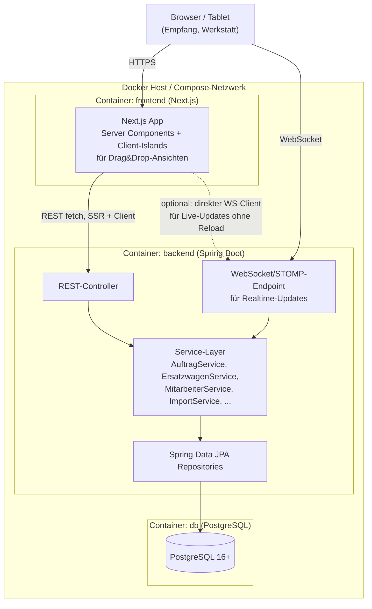

### 13.1 Warum diese Aufteilung sinnvoll ist
- **DB-Container:** persistente Daten, unabhängig skalier-/austauschbar, Standard-Backup-Tools
  (`pg_dump`) nutzbar — löst gleichzeitig das heute offene Backup-Fragezeichen
  (siehe `CLAUDE_CONTEXT.md`, Abschnitt "Auffälligkeiten").
- **Backend-Container:** Spring Boot übernimmt Validierung, Business-Regeln (die im IST-Code
  fast komplett im Client-JavaScript stecken, siehe Bugs #1, #2, #5), zentrale Autorisierung
  (aktuell nicht vorhanden), einheitliche Realtime-Verteilung.
- **Frontend-Container:** Next.js für SSR (schnelles erstes Laden auf Werkstatt-Tablets, die
  ggf. ältere Hardware sind) und React für die stark interaktiven Drag&Drop-Ansichten
  (Dashboard, Termine, Ersatzwagen-Kalender, Mitarbeiter-Kalender — vier fast identische
  Drag-Select-Implementierungen im IST-Code, im Neubau ein wiederverwendbares Component
  `<DragRangeCalendar>` wert).

### 13.2 Datenbankwahl: PostgreSQL vs. MongoDB

Der User hat beide zur Wahl gestellt — hier die Analyse anhand der tatsächlichen Datenstruktur:

**Für PostgreSQL spricht:**
- Die Domäne ist **klar relational**: Auftrag→Kunde (N:1), Auftrag→Fahrzeug (N:1),
  Auftrag↔Service-Leistung (N:M), Notiz↔Mitarbeiter (N:M), Ersatzwagen→Buchung (1:N) — genau der
  Fall, für den ein RDBMS gebaut ist.
- Viele Abfragen sind **bereich-/datumsbasiert** (Kapazitätsübersicht über 2 Wochen,
  Verfügbarkeitsprüfung ±2 Tage, Mitarbeiterkalender pro Monat, Jahresstatistik) — SQL-
  Bereichsabfragen mit Indizes sind hier performanter und einfacher korrekt zu schreiben als
  äquivalente Mongo-Aggregations-Pipelines.
- **Bug #2 und #14 sind strukturell Integritätsprobleme** (fehlende Fremdschlüssel, zwei
  Wahrheitsquellen) — genau das, was referenzielle Integrität + Constraints in Postgres
  automatisch verhindert.
- Spring Data JPA + Postgres ist der ausgetretene, bestdokumentierte Pfad für Spring Boot.

**Für MongoDB spräche** (Vollständigkeit halber): Die *heutige* Speicherung ist bereits
Dokument-artig (JSON-Blob pro Zeile) — ein 1:1-Port wäre mit Mongo am schnellsten machbar, ohne
Normalisierung nachzudenken. Das widerspricht aber explizit dem Wunsch nach einem **sauberen
Neubau mit Docker/Spring/relationalem Anspruch** und würde Bug #2/#14 strukturell nicht
beheben, sondern nur "schön verpackt" weiterschleppen.

**Empfehlung:** PostgreSQL. MongoDB wäre nur dann die bessere Wahl, wenn absehbar ist, dass das
Schema sich sehr häufig und unvorhersehbar ändert (z. B. völlig freie, pro Werkstatt
unterschiedliche Auftragsformulare) — dafür gibt der IST-Code aber keinen Hinweis; die
Feldliste in Abschnitt 11.2 ist seit der letzten Änderung (Mai 2026 laut Dateidatum) stabil.

### 13.3 Realtime-Mechanismus im Neubau

Drei realistische Optionen für den Ersatz von Socket.IO:
1. **Spring WebSocket + STOMP** — nächster Verwandter zu Socket.IO, breite Next.js-Client-
   Unterstützung, volle bidirektionale Kommunikation. Empfehlung, da am nächsten am IST-Verhalten.
2. **Server-Sent Events (SSE)** — einfacher (nur Server→Client), reicht, wenn Schreiboperationen
   ausschliesslich über REST laufen und nur die Push-Benachrichtigung an andere Clients gebraucht
   wird (was dem IST-Verhalten faktisch schon entspricht: Schreiben ist immer ein expliziter
   Save-Call, "Live-Update" ist nur Broadcast an die anderen).
3. **Polling** — explizit **nicht** empfehlenswert; der IST-Code hat einen toten Polling-Stub
   (`startPolling(){}`), der bewusst durch Sockets ersetzt wurde — ein Rückschritt.

---

## 14. REST-API-Entwurf

Abgeleitet 1:1 aus den in Abschnitt 3/11 beschriebenen Funktionen. Realtime-Events (WS/STOMP)
ergänzend zu den Schreiboperationen, nicht extra aufgeführt.

| Methode & Pfad | Zweck | Entspricht IST-Funktion |
|---|---|---|
| `GET /api/auftraege?von=&bis=&status=&suche=` | Aufträge filtern/suchen | `renderAuftraege`, `renderTermine` |
| `POST /api/auftraege` | Neuen Auftrag/Termin anlegen | `buildAuftrag` + Schritt 2→3 |
| `PATCH /api/auftraege/{id}` | Auftrag bearbeiten (voll) | `saveEditTermin` |
| `PATCH /api/auftraege/{id}/status` | Nur Status ändern | `evSetStatus` |
| `PATCH /api/auftraege/{id}/position` | Lift + Reihenfolge ändern (Drag&Drop) | `dropZone drop`-Handler |
| `PATCH /api/auftraege/{id}/auftragsnummer` | Externe Nummer nachtragen | `goStep(4)` |
| `DELETE /api/auftraege/{id}` | Löschen | `deleteA` |
| `GET /api/kapazitaet?von=&bis=` | Kapazitätsraster-Daten | `renderKapazitaet` |
| `GET /api/kunden?suche=` | Kundensuche (eigene Stammdaten, nicht Import-Cache) | neu (siehe Abschnitt 8.2) |
| `GET /api/ersatzwagen` / `POST` / `PUT/{id}` / `DELETE/{id}` | Poolfahrzeug-Stammdaten | `ewSpeichernFzg`, `ewVwLoeschen` |
| `GET /api/ersatzwagen/{id}/verfuegbarkeit?von=&bis=` | Einheitliche Verfügbarkeitsprüfung (behebt Bug #2) | `renderEWVerfug` + `ewRenderKalender` vereint |
| `POST /api/ersatzwagen-buchungen` | Buchen (aus Wizard oder EW-Kalender, ein Endpunkt) | `goStep(3)`-EW-Teil + `ewSpeichernBelegung` |
| `PATCH /api/ersatzwagen-buchungen/{id}/zurueckgeben` | Rückgabe erfassen | `ewZurueck` |
| `GET/POST/PATCH/DELETE /api/todos` | To-do-CRUD | `tdAddNeu`, `tdSaveEdit`, `tdToggleDone`, `tdDelete` |
| `GET/POST/PATCH/DELETE /api/notizen` | Notiz-CRUD | `pinnwandSpeichern`, `pwSaveInfos`, `pwDelete` |
| `PATCH /api/notizen/{id}/archivieren` / `/reaktivieren` | Archiv-Workflow | `pwArchivieren`, `pwUnarchiv` |
| `POST /api/notizen/{id}/aufgaben` | Unteraufgabe (erzeugt automatisch Todo, serverseitig konsistent statt Bug #10) | `pwAddAufgabe` |
| `GET/POST/PUT/DELETE /api/mitarbeiter` | Mitarbeiter-Stammdaten | `maSaveMA`, `maDeleteMA` |
| `GET/POST/DELETE /api/mitarbeiter/{id}/abwesenheiten` | Kalender-Events | `maSaveEV`, `maDeleteEV` |
| `GET /api/mitarbeiter/statistik?jahr=` | Ferien-/Fremdarbeits-Auswertung (serverseitig korrekt berechnet, behebt Bug #1) | `maRenderStat` |
| `GET /api/feiertage?jahr=` | Feiertage Kanton ZH (weiter zur Laufzeit berechnet oder gecacht) | `feiertageZH` |
| `POST /api/import/adressliste` (multipart) | Excel-Import Kunden | `importAdr` |
| `POST /api/import/fahrzeugliste` (multipart) | Excel-Import Fahrzeuge | `importFzg` |
| `GET /api/import/cache?suche=` | Import-Cache durchsuchen | `renderDbPreview`, `dbSuche` |
| `DELETE /api/import/cache` | Import-Cache löschen | `dbLoeschen` |
| `GET /api/service-leistungen` | Stammliste der 8 (künftig admin-pflegbaren) Service-Positionen | ersetzt hartcodierte `sMap` |
| `GET /api/status` | Health/Counts | `/api/status` (bereits vorhanden) |

**Bewusst nicht übernommen:** `GET /api/reset` als ungeschützter Alles-Löschen-Endpunkt (Bug
#12) — im Neubau höchstens als admin-geschützte, POST-basierte, bestätigungspflichtige Aktion.

---

## 15. Offene Entscheidungen & Brainstorming

Diese Punkte kann der IST-Code nicht beantworten — reine Architektur-/Produktentscheidungen für
das Gespräch mit dem Kollegen:

1. **Benutzerkonten & Rollen:** Bleibt es bei "jeder im Netz darf alles" (passend zu einem
   kleinen Familienbetrieb), oder kommen echte Logins? Falls ja: reicht ein einfacher
   Mitarbeiter-PIN pro Tablet, oder braucht es Rollen (Empfang vs. Mechaniker vs. Leitung mit
   unterschiedlichen Rechten, z. B. nur Leitung darf Mitarbeiterstatistik/Löschungen)?
2. **Kunde/Fahrzeug als echte Stammdaten (Abschnitt 8.2) vs. bewusst bei "alles am Auftrag
   kopiert" bleiben?** Für echte Stammdaten spricht Datenqualität/Historie; dagegen spricht,
   dass die heutige App **absichtlich** nie eine eigene Kundendatenbank pflegen wollte (die
   Quelle der Wahrheit ist explizit SwissGarage/C16, nicht diese App) — eine eigene
   Kunden-Stammtabelle könnte zu einer zweiten, konkurrierenden Wahrheit führen, die genauso
   veraltet wie der heutige Import-Cache.
3. **Soll die App künftig aktiv mit dem externen ERP integrieren** (Auftragsnummer automatisch
   abholen, Rechnungsstatus zurückspielen), oder bleibt der manuelle Medienbruch (Abschnitt 4.1,
   Schritt E7→E8) bestehen? Hängt komplett davon ab, ob das SwissGarage/C16-Altsystem überhaupt
   eine Schnittstelle (Datei-Export, DB-Zugriff, API) hergibt — dazu liegen keine Informationen
   vor, wäre separat zu klären (siehe C16-Ordner-Analyse in `CLAUDE_CONTEXT.md`).
4. **Lift-Anzahl konfigurierbar machen** (Bug #13) — lohnt sich nur, wenn absehbar ist, dass sich
   die Anzahl Hebebühnen künftig ändert; sonst ist eine feste `LIFT`-Stammtabelle mit heute 3
   Einträgen unnötige Komplexität.
5. **Service-Leistungen admin-pflegbar** (statt der 8 hartcodierten Checkboxen) — sinnvoll, wenn
   sich das Leistungsangebot ändert (z. B. neue Position "HV-Batterie-Check" angesichts der
   `HV`-Schulungsunterlagen im Fileshare, die auf E-Fahrzeug-Kompetenz hindeuten).
6. **Wie weit soll Bug #1–#14 "repariert" statt "genau nachgebaut" werden?** Meine Empfehlung:
   alle 14 Punkte sind reine **Bugs**, kein gewolltes Verhalten — beim Neubau grundsätzlich
   korrekt implementieren (z. B. Statistik funktionierend, eine Ersatzwagen-Wahrheit, dynamische
   Mitarbeiterlisten überall). Das entspricht der Bitte "alle Funktionen behalten", nicht "alle
   Fehler behalten".
7. **Denormalisierte Nummern-Formate** (`aufnr` mal `"420"`, mal `"A-2026-418"`) — für den
   Neubau ein reines Freitextfeld belassen (so wie heute) oder ein Formatmuster erzwingen?
   Hängt davon ab, wie C16 seine Nummern tatsächlich vergibt (unbekannt, siehe Punkt 3).
8. **Mobile/Touch-Priorität:** Der IST-Code hat einen expliziten Touch-Drag-Polyfill (Abschnitt
   11, Dateiende) — ein Hinweis, dass Tablets am Empfang/in der Werkstatt tatsächlich genutzt
   werden. Im Neubau: natives Pointer-Events-API (ersetzt HTML5-Drag&Drop ohnehin vollständig
   und braucht keinen Polyfill) einplanen.
9. **Offline-Fähigkeit:** Der IST-Code hat einen kompletten Offline-Fallback (`file://`-Modus +
   `localStorage`). Ist das im Neubau weiterhin gefordert (z. B. bei WLAN-Ausfall in der
   Werkstatthalle), oder reicht "Server muss erreichbar sein" bei einer saubereren
   Docker-Compose-Instanz im lokalen Netz?
10. **Backup/Betrieb:** Wer betreibt die 3 Container (NAS mit Docker-Unterstützung? separater
    Mini-PC?), wer macht `pg_dump`-Backups, wie wird das mit dem bestehenden
    `Datensicherung`-Ordner-Workflow (siehe `CLAUDE_CONTEXT.md`) verzahnt?

---

## 16. Nicht-funktionale Anforderungen

Aus dem IST-Verhalten abgeleitet (nicht explizit dokumentiert, aber durch Code-Vorhandensein
belegt):

- **Mehrbenutzerfähigkeit in Echtzeit** ist ein Kernfeature (Socket.IO-Broadcast an alle
  offenen Clients) — mehrere Tablets/PCs gleichzeitig im Einsatz.
- **Schweizer Lokalisierung**: `de-CH`-Datumsformate überall, CHF/Swiss-Adressformat
  (PLZ+Ort), Kanton-ZH-Feiertage, Telefonformat `044/079 xxx xx xx`.
- **Drucken** ist ein Pflichtfeature (dedizierter `@media print`-Block, eigener
  `#printarea`-Container) — Auftragszettel auf Papier für die Werkstatt/den Kunden.
- **Touch/Tablet-tauglich** (siehe Punkt 8 oben).
- **Kein Internetzugriff vorausgesetzt für den Kernbetrieb** ausser für zwei CDN-Ressourcen
  (Google Fonts, Tabler-Icons-Webfont) — im Neubau idealerweise selbst gehostet, um die
  Docker-Compose-Lösung wirklich autark vom Internet zu machen.
- **Performance:** Datenmengen sind klein (siebenstellige Auftragszahlen unrealistisch für einen
  Kleinbetrieb) — kein Hinweis auf Pagination-Bedarf im IST-Code (alle Listen werden komplett im
  Client gehalten und gefiltert). Für den Neubau reicht Pagination "falls nötig", keine
  Premature-Optimization nötig.

---

*Ende der Tiefenanalyse. Nächster Schritt wäre üblicherweise, die Punkte aus Abschnitt 15
gemeinsam mit dem Kollegen zu klären, bevor das Spring-Datenmodell aus Abschnitt 8/9 final
gegossen wird.*
